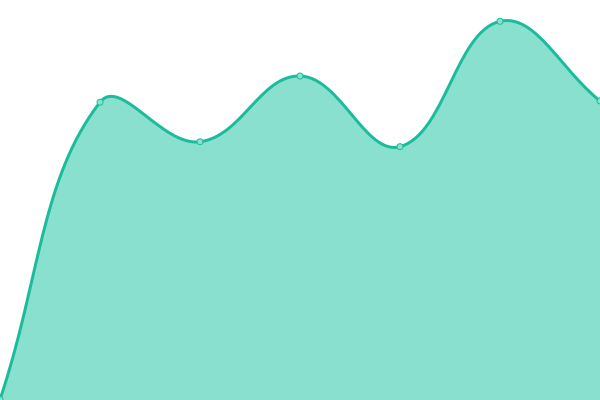

# [📈 Live Status](https://status.onli.com.br): <!--live status--> **🟩 All systems operational**

This repository contains the open-source uptime monitor and status page for [onliseguros](https://www.onli.com.br), powered by [Upptime](https://github.com/upptime/upptime).

With [Upptime](https://upptime.js.org), you can get your own unlimited and free uptime monitor and status page, powered entirely by a GitHub repository. We use [Issues](https://github.com/onliseguros/status/issues) as incident reports, [Actions](https://github.com/onliseguros/status/actions) as uptime monitors, and [Pages](https://status.onli.com.br) for the status page.

<!--start: status pages-->
<!-- This summary is generated by Upptime (https://github.com/upptime/upptime) -->
<!-- Do not edit this manually, your changes will be overwritten -->
<!-- prettier-ignore -->
| URL | Status | History | Response Time | Uptime |
| --- | ------ | ------- | ------------- | ------ |
|  [API - v1](https://api.onli.com.br/v1) | 🟩 Up | [api-v1.yml](https://github.com/onliseguros/status/commits/HEAD/history/api-v1.yml) | 

 664ms
     
 | 

<a href="https://status.onli.com.br/history/api-v1">100.00%</a>
    

|  [ID](https://id.onli.com.br) | 🟩 Up | [id.yml](https://github.com/onliseguros/status/commits/HEAD/history/id.yml) | 

 682ms
     
 | 

<a href="https://status.onli.com.br/history/id">100.00%</a>
    

|  [Manager](https://manager.onli.com.br) | 🟩 Up | [manager.yml](https://github.com/onliseguros/status/commits/HEAD/history/manager.yml) | 

 656ms
     
 | 

<a href="https://status.onli.com.br/history/manager">100.00%</a>
    

|  [Website](https://www.onli.com.br) | 🟩 Up | [website.yml](https://github.com/onliseguros/status/commits/HEAD/history/website.yml) | 

 253ms
     
 | 

<a href="https://status.onli.com.br/history/website">100.00%</a>
    

<!--end: status pages-->

[**Visit our status website →**](https://status.onli.com.br)

## 📄 License

- Powered by: [Upptime](https://github.com/upptime/upptime)
- Code: [MIT](./LICENSE) © [onliseguros](https://www.onli.com.br)
- Data in the `./history` directory: [Open Database License](https://opendatacommons.org/licenses/odbl/1-0/)
